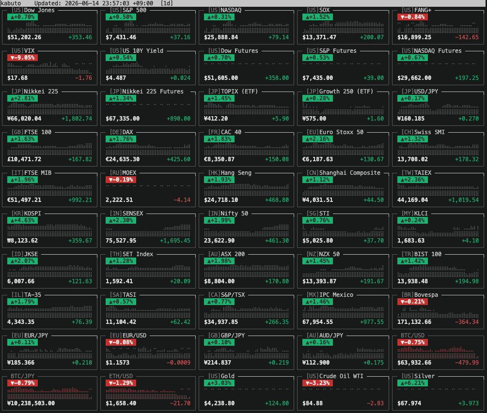

# kabuto

A terminal dashboard for global markets — stock indices, futures, forex, crypto and commodities at a glance.



> Regenerate with [vhs](https://github.com/charmbracelet/vhs): `vhs demo/screenshot.tape` (still image) or `vhs demo/demo.tape` (GIF)

(Originally a CLI clone of sekai-kabuka.com.)

## Installation

### Homebrew

```bash
brew install kzcat/tap/kabuto
```

### AUR (Arch Linux)

```bash
yay -S kabuto-bin
```

### Nix

```bash
nix run github:kzcat/kabuto
```

### winget (Windows)

```powershell
winget install kzcat.kabuto
```

### Scoop (Windows)

```powershell
scoop bucket add kzcat https://github.com/kzcat/scoop-bucket
scoop install kabuto
```

### go install

```bash
go install github.com/kzcat/kabuto/cmd/kabuto@latest
```

### GitHub Releases

Download the latest binary for your platform from the
[Releases](https://github.com/kzcat/kabuto/releases) page, extract it,
and place it somewhere in your `$PATH`.

## Usage

```bash
# Show every section once
kabuto

# Japan section only
kabuto -s japan

# Multiple sections
kabuto -s japan -s us

# Auto-refresh every 30 seconds (interactive watch mode)
kabuto -w 30

# JSON output
kabuto -j

# No colors (ASCII box drawing)
kabuto --no-color

# Red=up / green=down (Japanese convention)
kabuto --rg

# Display times in a specific timezone
kabuto --tz America/New_York

# Override the detected home market country
kabuto --country JP

# Add ad-hoc symbols to watchlist
kabuto --add AAPL --add TSLA:USD:2

# Use a specific data source
kabuto --source stooq

# Select history range
kabuto --range 1mo

# Use a color theme
kabuto --theme mono

# Custom config file
kabuto --config ~/my-kabuto.json

# Version
kabuto -v
```

## Options

| Flag | Description |
|------|-------------|
| `-s, --section NAME` | Show only these sections (repeatable) |
| `-w, --watch SECONDS` | Auto-refresh every N seconds |
| `--rg` | Red=up / green=down (Japanese convention) |
| `-j, --json` | Output JSON |
| `--no-color` | Disable colors, use ASCII box drawing |
| `--tz NAME` | IANA timezone for displayed times |
| `--country ISO2` | Override home market country (e.g. JP, US, DE) |
| `--add SYMBOL[:CC[:DEC]]` | Add ad-hoc symbol to Watchlist (repeatable) |
| `--config PATH` | Config file (default `~/.config/kabuto/config.json`) |
| `--source auto\|yahoo\|stooq` | Data source (default `auto`) |
| `--range 1d\|5d\|1mo\|6mo\|1y` | History range (default `1d`) |
| `--theme NAME` | Color theme (`default`\|`mono`\|`light`\|`highcontrast`) |
| `-v, --version` | Print version and exit |

The home market section is auto-detected from `$LC_ALL` / `$LANG`
(falling back to US) and moved to the front.

## Interactive Keys (watch mode)

| Key | Action | Key | Action |
|-----|--------|-----|--------|
| `q` / `Esc` | Quit | `1`–`9` | Toggle section |
| `r` | Refetch now | `0` / `a` | Show all sections |
| `c` | Cycle color mode | `f` | Toggle full-height |
| `+` / `-` | Adjust columns | `?` / `h` | Help overlay |
| `=` | Auto columns | `Space` | Pause/resume |

## Sections

`japan` · `us` · `us-futures` · `europe` · `asia` · `mideast-america` · `forex` · `crypto` · `commodity`

## Build

```bash
git clone https://github.com/kzcat/kabuto.git
cd kabuto
go build -o kabuto ./cmd/kabuto
```

## Test

```bash
go test ./...
```

## License

MIT
